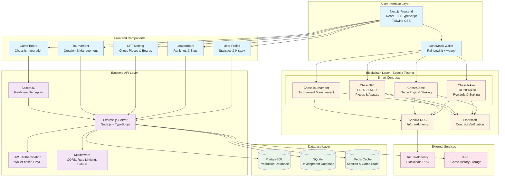
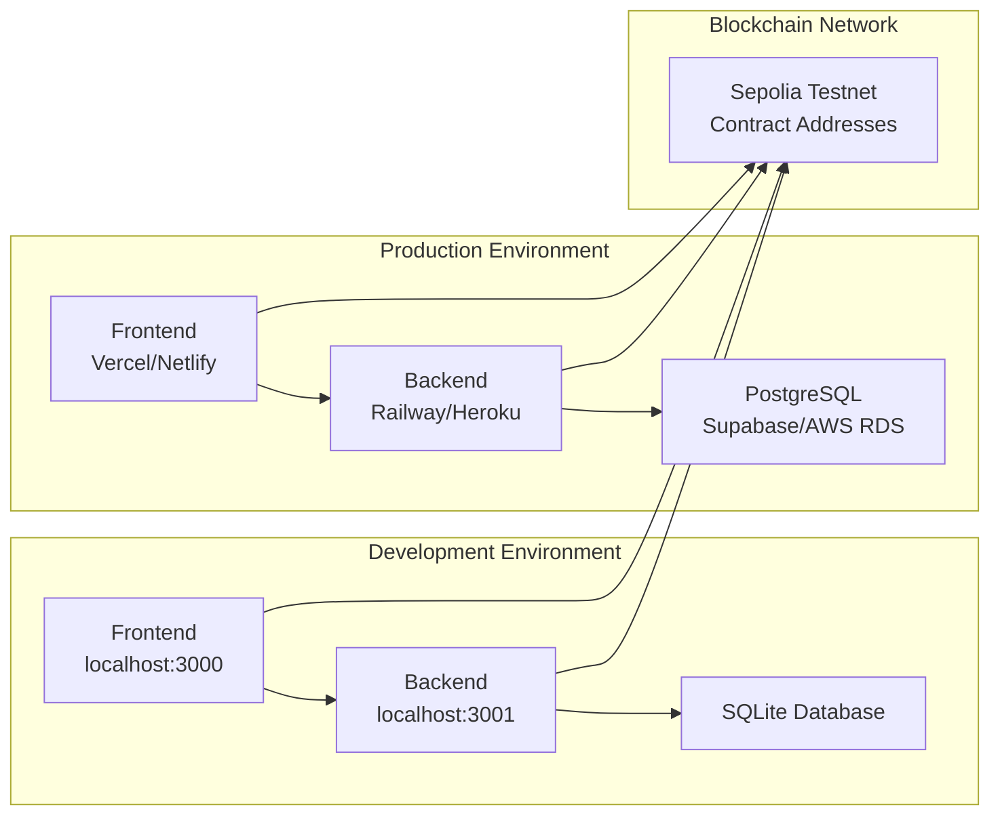

# ChessFi - Full-Stack Web3 Architecture Diagram

## System Architecture Overview

## Technology Stack Details

### Frontend (Next.js 15)

- **Framework**: Next.js with App Router
- **Language**: TypeScript
- **Styling**: Tailwind CSS
- **Web3 Integration**: wagmi + viem + RainbowKit
- **State Management**: React Query (TanStack Query)
- **UI Components**: Radix UI + Custom Components
- **Real-time**: Socket.IO Client
- **Chess Logic**: chess.js library

### Backend (Node.js/Express)

- **Runtime**: Node.js v18+
- **Framework**: Express.js
- **Language**: JavaScript
- **Authentication**: JWT + Wallet-based SIWE
- **Real-time**: Socket.IO
- **Database ORM**: Sequelize
- **Security**: Helmet, CORS, Rate Limiting
- **Validation**: Joi
- **Blockchain**: ethers.js + web3.js

### Database

- **Production**: PostgreSQL
- **Development**: SQLite
- **Caching**: Redis (optional)
- **Models**: User, Game, Tournament, NFT

### Smart Contracts (Solidity)

- **ChessToken**: ERC20 token with staking rewards
- **ChessNFT**: ERC721 for chess pieces and avatars
- **ChessGame**: Game logic with crypto staking
- **ChessTournament**: Tournament management system
- **Network**: Sepolia Testnet
- **Framework**: Hardhat

### Key Features

1. **Real-time Chess Gameplay** with Socket.IO
2. **Wallet-based Authentication** using Sign-In With Ethereum
3. **Crypto Staking** for game participation
4. **NFT Minting** for chess pieces and boards
5. **Tournament System** with prize distribution
6. **Leaderboard** with player statistics
7. **Token Rewards** for gameplay and achievements

## Deployment Architecture

## Security & Performance Features

- **JWT Authentication** with wallet signature verification
- **Rate Limiting** to prevent abuse
- **CORS Protection** for cross-origin requests
- **Input Validation** using Joi schemas
- **SQL Injection Protection** via Sequelize ORM
- **Real-time Communication** with Socket.IO
- **Caching Strategy** with Redis
- **Database Migrations** for schema management
- **Environment-based Configuration** for different deployments
